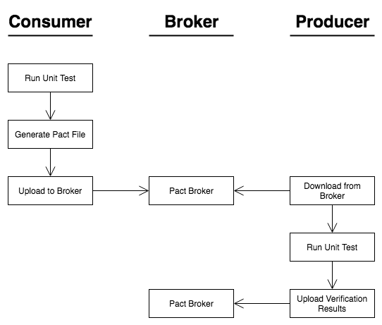

slidenumbers: true
autoscale: true
theme: Next, 9

# Pact Testing...wat? 

# 🤔

---

## About this presentation 

 - Lecture 📊 (~30mins)
 - Questions 
 - No live demo 🙏

#### PS - Please ask questions!

---

# 🤔

^ Who here has heard of Pact testing?

---

>Pact is a contract testing tool. Contract testing is a way to ensure that services (such as an API provider and a client) can communicate with each other. Without contract testing, the only way to know that services can communicate is by using expensive and brittle integration tests.

– Pact Foundation 😮

---

>...Do you set your house on fire to test your smoke alarm? No, you test the contract it holds with your ears by using the testing button. Pact provides that testing button for your code, allowing you to safely confirm that your applications will work together without having to deploy the world first.

– Pact Foundation 🔥

---

### What is Pact Testing?

>A method of testing to that ensures that services abide by a set of expections set by consuming services

  – Will Vedder, circa 2019  🧐

--- 

## Pacts describe content agreement:

- Data "shape" 
- Existence of _certain_ fields 
- Assert field types (string vs int vs bool)

---
## Wait, aren't you describing integration testing?

# 🤔

---

# Pact Test vs Integration Test

 - Int. tests describe relationship
 - Int. tests: good for failure, Pact is not
    - Network failures, timeouts, malformed data
 - Int. tests may test external APIs

---

> Pact tests define what the agreement between a consumer and a provider is. Integration tests check how that agreement is implemented on the consumer side

– io.tv.com/scala-pact

---

# Terminology

 - **Pact Testing** - Aka "consumer-driven contract testing",
 - **Pacts** - Aka "pact file" or "contract", the JSON-serialised consumer-driven assertions 
 - **Provider** - A service that _provides_ data to other service(s)
 - **Consumer** - A service or UI that _consumes_ data from a provider
 - **Verification** - The process of confirming that the provider abides by pacts
 - **Verifier** - The Pact service that _verifies_ the provider complies with pacts

---

## When Pact is a good fit

 - When organization controls both consumer and provider
 - Multiple consumers to a provider
 - Consumers with multiple provider deps

---

But we're all on the same team, we can coordinate these breaking changes ourselves...

^ Communication, inadvertant breaking, 

---

## What Pact isn't good for

 - Testing external APIs
 - Developing services where consumer doesn't drive
 - Perfomance or load testing

--- 

## Upsides

- Prevents breaking API changes from deploying 👌
- Generation and verification of pacts are automatically managed
- Minimal additions to provider...EASY!😄

--- 

## Downsides 🙁

 - Requires provider to spin up instance in CI
 - Tests only as good as the contract
 - Bad contract => bad time
 - Onus on consumer to write contacts (usually Connect)
 - Onus on the consumer to _update_ contracts  

--- 

---

# Example Scenario:

Connect API consuming data from service XYZ

### Broad strokes:

0. Instatiate Pact Broker (one-time process)
1. Consumer generates pacts
2. Provider verifies compliance w/ pacts (at build time)

---

## Broker

[http://pact-broker.kube.sidecar.cc](http://pact-broker.kube.sidecar.cc)

 - Common storage location of pacts
 - No service <=> service communication
 - Central "hub" 
 - One time setup

---

## Substeps - Consumer 

1. Connect API creates unit-test asserting certain properties
2. Run unit tests in CI (Pact and Jest create mock service)
3. Unit tests generate pact files (contracts)
4. CI runs script to publish pacts to broker

[Example pact unit test](https://github.com/Getsidecar/connect-api/blob/6e588f015a00eddd9afae6a194ea703f7b777b89/src/data-sources/__tests__/paid-search.pact.js)

[Example generated pact](https://github.com/Getsidecar/connect-api/blob/6e588f015a00eddd9afae6a194ea703f7b777b89/pacts/connect-api-sims-paid-search.json)

---

## Substeps - Provider 

0. Provider service makes code change, builds w/ CI
1. Pact Verifier container spins up in Jenkins
2. Pact Verifier retrieves pacts from broker
3. Pact Verifier verifies provider complies with pacts
5. Success? Publish success to broker
6. ??? Profit!!

---

---

### In practice: provider CI

---

### In practice: provider

(After pushing code change)

---

### In practice: consumer

Modifying unit test accordingly ✏️

---

### In practice: consumer

Publishing pacts (usually done in CI)

---

### In practice: provider 🎉

After rebuild 

---

### In practice: provider 😡

(Jk this is actually what happened)

--- 

# Diagram

(final time I promise)

---

## Theory vs Practice 🤓
 
 - How many false positives will this catch?
 - Tooling is wonky (hopefully done now)
 - How much overhead does this add for newcomers?(hopefully none)

--- 

# Cold realization 

The quality of verification is only as good as the quality of the contract

---

## Other considerations

 - What's the protocol for fixing a failure?
 - Do we need additional process or communication channels?
 - Do we want to employ only for production or for staging too?

---

## TYVM